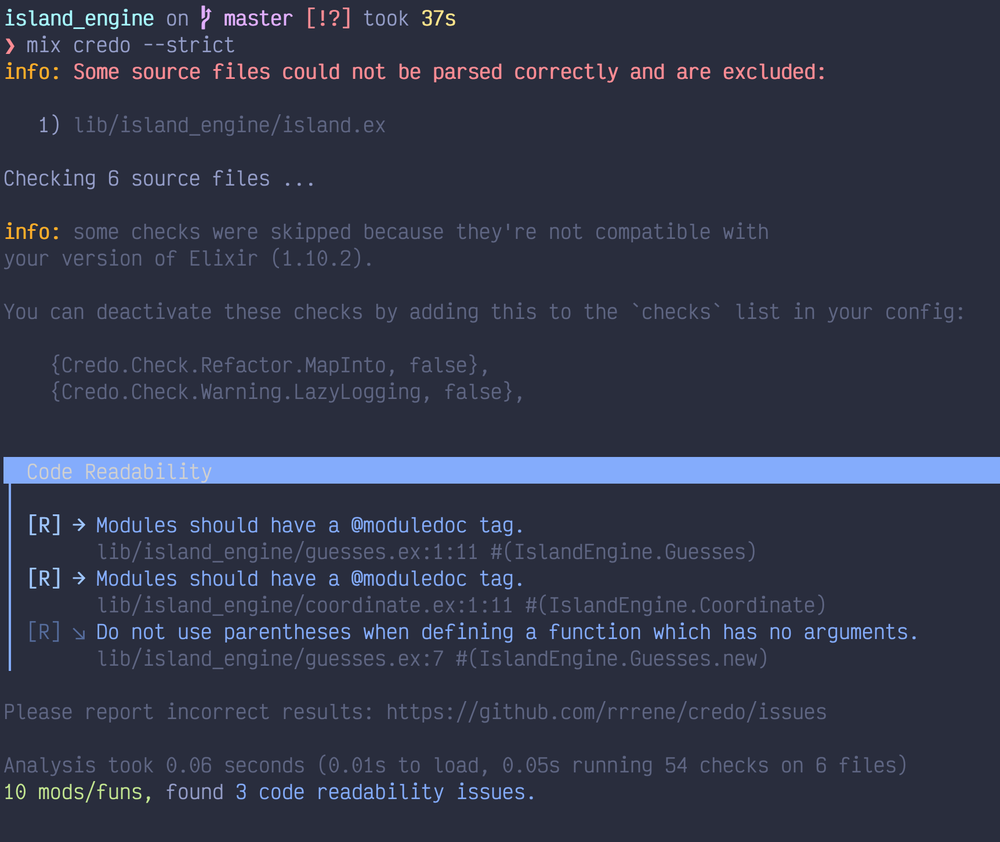

So I was doing some JS today, despite everything we can say about Javascript. It has a great tooling environment. It helps a lot to have standards. Funky coding style or inconsistency can lead to misunderstanding of some concepts.

It's not a secret, I'm learning Elixir. And I'm doing this differently than all the others. 


## By reading books.

That's quite new for me. Before, I used to go on Youtube, Codecademy or Udemy. Watching other people code what I wanted to code. It was a passive way of learning. No problem-solving. It's a soft and warm place.

Anyway, I was wondering if Elixir has one of these tools. And the fact is that it has. It's called [Credo](https://github.com/rrrene/credo).

## Credo

With more than 130 contributors, 2K commits and 3.3k stars on Github it seems that it is the defacto tool for static code analysis in Elixir. I'm so grateful that some people out there built a tool like this one.
Enforcing code style and give some hints on how it could be better is a nice thing to have.

Furthermore, Credo comes with a lot of configuration capabilities.

### In action

Simply add credo to your `mix.exs` file to get credo.
```elixir
defp deps do
  [
    {:credo, "~> 1.2", only: [:dev, :test], runtime: false}
  ]
end
```

And that's pretty much it, it runs out of the box.
To get an analysis, type: 
```
mix credo
```

And to enforce some strict styling guide

```
mix credo --strict
```

This is the kind of output you can wait to have by using credo.



The arrow '`->`' shows up the priority of the issue.
So far so good, we have now a very good tool to help us styling out our code regarding standard guide.

I've didn't feel the use of Credo, even in little project, but I'm changing my mind. You often go for Prettier and/or JS/TSLint while doing JS or Rubocop while doing Ruby. Why Elixir wouldn't be the same ?
