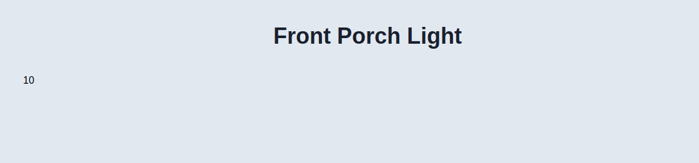
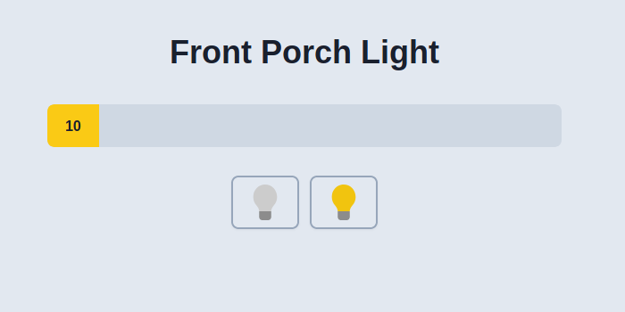
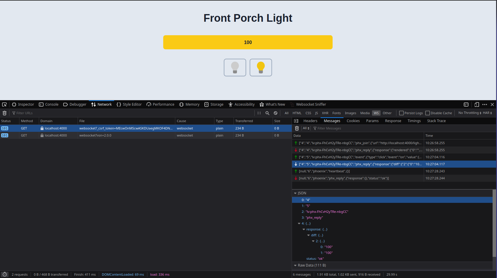
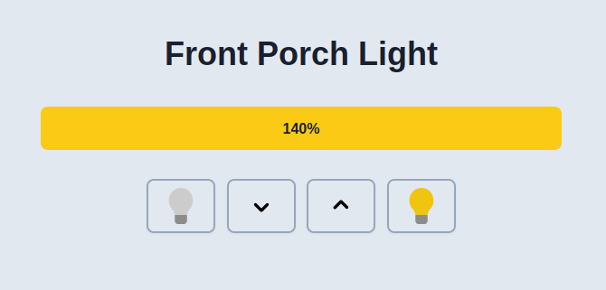

I do not talk really much of front-end stuff.
Not I hate front-end or whatsoever, but I feel more confortable on the server-side of things 😎
Before, cool kids and hispters does Rails dev, nowadays, we can genuinely say that the front-end world got all the love.

I think it's mostly because the front is the realm of can be seen, instant feedback, no compilation (WEBPAAAAACK), HMR, etc. Really cool stuff isn't it ?
Compared to a Java/Spring backend, where you need to define classes, repository layer, domain layer, rest services and so on and so forth, you need to write a lot of thing to get this kinda magic and instant feedback.

## What's the point ?

Well, imagine have the rich user experience of the client side annnnd the ease of development and stability of server side ?
Like, you could implement (again...) a feature from server to front, with the same language, and writing the minimum javascript necessary.
Sounds good ? Sounds fun ? Sounds fake.

Recently, a lot of new libraries goes out with this `new Promise`.
Writing, rich user application with server side rendering, with minimal javascript.

We can say, Livewire, AnyCable and StimulusReflex. Here, I'm gonna talk about LiveView. I don't know which comes first and I do not care.
I care especially on what it can bring to us, developers.

A connexion between a front-end component and a bucket of functions via a web socket.

## Let's go

So we need to create a new Phoenix application, thanks to v1.5 it's now as easy as a mix command to generate a LiveView project.
It's important to say that liveview can live with "traditionnal" Phoenix MVC application. It can even been embedded in. So cool.

```
mix phx.new LiveViewStudio
mix phx.gen.live Context Schema table column:type

e.g: $ mix phx.gen.live Accounts User users name:string age:integer
```

That's what the docs tells us.

Good, now go straight to the router, with Liveview you can litterally write a Phoenix app without any controller. Sooo cool.

<script src="https://gist.github.com/Maartz/ae20e3eb350f1eba1d58d51754c8277f.js"></script>

Add this `live /light, LightLive` to the router file.

`live` is a macro which takes a path and a module. This module is not a controller as I said before but much a long running liveview process.


We need to define this new module, in the live folder created by the mix command. It lives in the web part of the Phoenix application.

<script src="https://gist.github.com/Maartz/36fe8a0b997bbed57172d40bf9df91f9.js"></script>

LiveView use what they call callbacks, mount is one of them.
It takes 3 arguments, the params, the session data and the socket connexion.

The socket is a struct and we can update this one by using the `assign` function.
We set a key of `brightness` and set it to 10.

Using `IO.inspect` function, we can check whats look like the socket struct:

```elixir
Phoenix.LiveView.Socket<
  assigns: %{
    brigthness: 10,
    flash: %{},
    live_action: nil,
    live_module: LiveViewStudioWeb.LightLive
  },
  changed: %{brigthness: true},
  endpoint: LiveViewStudioWeb.Endpoint,
  id: "phx-FhB136GLzvVBQQEC",
  parent_pid: nil,
  root_pid: nil,
  router: LiveViewStudioWeb.Router,
  view: LiveViewStudioWeb.LightLive,
  ...
>
```

Good, we need to render something right now.
Fortunately, LiveView provides a callback to render, called... `render`

<script src="https://gist.github.com/Maartz/c19540196d472925cdf8226e45fd7ddb.js"></script>

The `~L` sigil is specific to LiveView, it lets us render heredoc template.
So we can grab the value from our passed assign this way.

```elixir
<%= @brightness %>
```

Good.

But for the moment, we just displays a single value which is not fantastic, there's nothing new here. Keep up.




<script src="https://gist.github.com/Maartz/d5bd9f478bdcb0301c0bac48563b2913.js"></script>

The LiveView sigil let us write real HTML, no `className` like in JSX whatsoever. SEO friendly per se.

Let's add the plus from LiveView, a special HTML attribute, a click event.

```elixir
phx-click="off"
```

It binds a click event with the value of the event to send to the server. Here it's the value `off`.

The value is send via websocket to the LiveLight long running process.

Do the same with `on`.

```elixir
phx-click="on"
```

<script src="https://gist.github.com/Maartz/4346408ed3ec6753cf14a7de0e5197ae.js"></script>



And now, we need to handle this sended message, and once again, its LiveView's job.

The callback method `handle_event` back us.

<script src="https://gist.github.com/Maartz/796dbf83737790756b9ed92f02aeda53.js"></script>

The first argument is the message send via websocket, the second is metadata and the third one is the socket struct, with our assign map.

We create a new socket based on the previous one with new value for the brightness key.
And send back this with a `{:noreply, socket}` tuple.
This follows the OTP philosophy, like in the `GenServer` with `handle_call` and `handle_cast`. Rather it's a call or a cast, it's expecting a `{:reply, data}` or `{:noreply, data}`. To be a 100% correct, it's the cast which doesn't wait for a reply.

At the end of the day, LiveView only re-render the part of the DOM which is updated, but this is not shadow DOM like in React or Vue, etc.
It's data send over the wire.

As you can see on this picture.



So far so good.

Let's add 2 buttons, up and down for incrementing and decrementing the value.

And this brings us to the `handle_event` callback, how do we grab the value and update it ?

```elixir
	def handle_event("up", _metadata, socket) do
		brightness = socket.assign.brightness + 10
		socket = assign(socket, :brightness, brightness)
		{:noreply, socket}
	end
```

So this is the first way, but I can be tedious and Phoenix gives us a shortcut as usual.

```elixir
	def handle_event("up", _metadata, socket) do
		socket = update(socket, :brightness, &(&1 + 10))
		{:noreply, socket}
	end
```

The update function takes an anonymous function aka lambda.
The `&(&1)` captures the value behind the `:brightness` key in the assign map.
So to update it, simply increment it by the value 10.

Same for the decrement.

```elixir
	def handle_event("down", _metadata, socket) do
		socket = update(socket, :brightness, &(&1 - 10))
		{:noreply, socket}
	end
```

But we got an issue here, the minimum and maximum value are not set.



Elixir's Kernel module, provides us an easy way to handle this.

`&min` and `&max`.

```elixir
def handle_event("up", _metadata, socket) do
  socket = update(socket, :brightness, &min(&1 + 10, 100))
  {:noreply, socket}
end

def handle_event("down", _metadata, socket) do
  socket = update(socket, :brightness, &max(&1 - 10, 0))
  {:noreply, socket}
end
```

Et voila, it's done.

<script src="https://gist.github.com/Maartz/4c7931865cd947eff09ad0b1a91bd57a.js"></script>

No any single line of custom Javascript. Only Elixir.

All credits goes to Nicole and Mike Clark from the PragmaticStudio, they release a terrific FREE course on LiveView. This blog post is based on the first video of their class.

If you want to go deeper, do not hesitate to check this out.
Much kudos to them.

[LiveView Pragmatic Studio FREE course](https://pragmaticstudio.com/courses/phoenix-liveview)